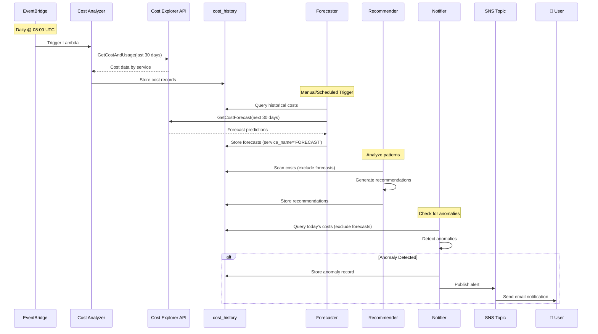
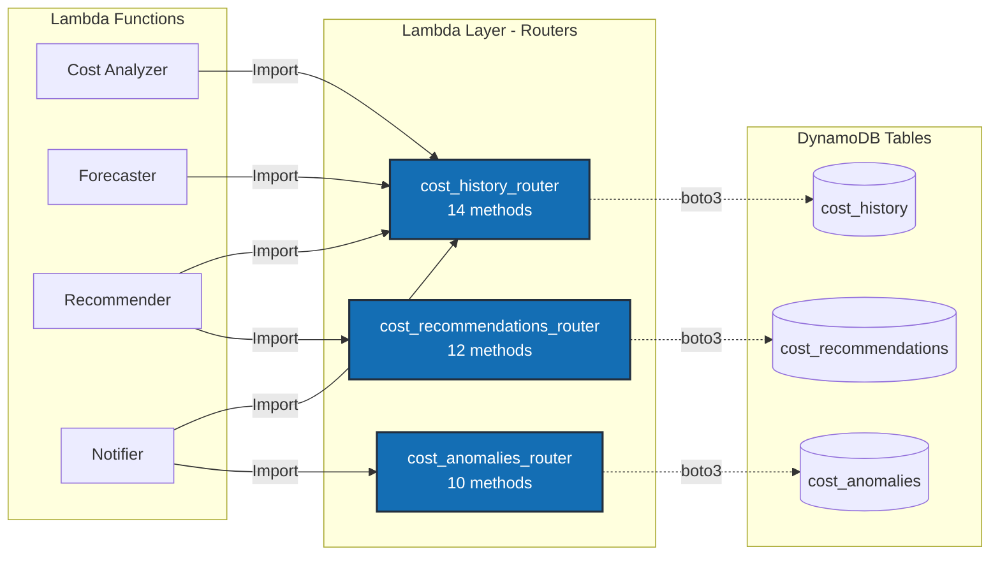
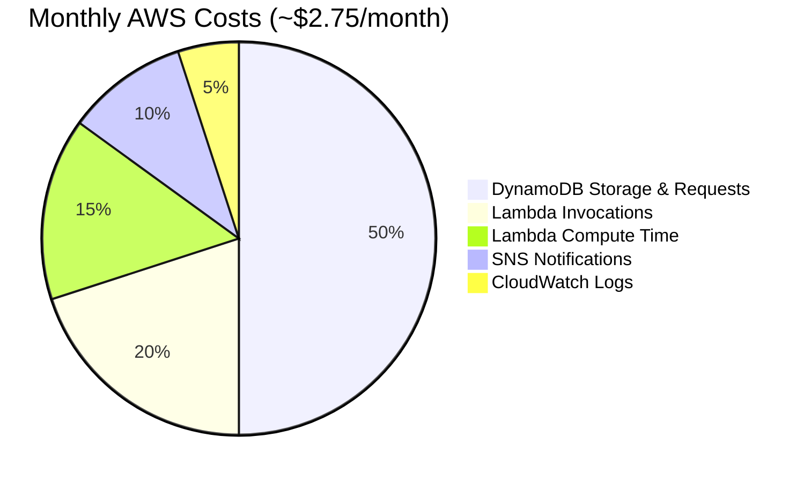
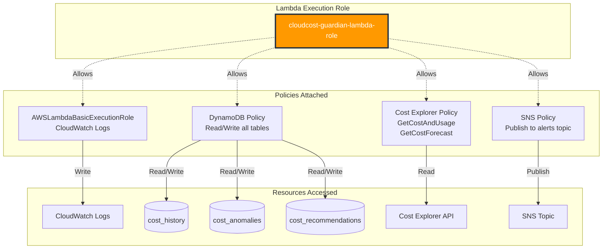

# CloudCost Guardian - Architecture Diagrams

## High-Level System Architecture

```mermaid
graph TB
    subgraph "Trigger Layer"
        EB[EventBridge Scheduler<br/>Daily @ 08:00 UTC]
    end

    subgraph "Processing Layer - AWS Lambda"
        CA[Cost Analyzer<br/>Python 3.11 | 256MB]
        FC[Forecaster<br/>Python 3.11 | 256MB]
        RC[Recommender<br/>Python 3.11 | 256MB]
        NT[Notifier<br/>Python 3.11 | 256MB]
    end

    subgraph "Data Layer - DynamoDB"
        CH[(cost_history<br/>PK: date<br/>SK: service_name)]
        AN[(cost_anomalies<br/>PK: anomaly_type<br/>SK: detection_date)]
        RE[(cost_recommendations<br/>PK: recommendation_type<br/>SK: generated_date)]
    end

    subgraph "AWS Services"
        CE[Cost Explorer API<br/>GetCostAndUsage<br/>GetCostForecast]
        SN[SNS Topic<br/>Email Alerts]
    end

    subgraph "Lambda Layer"
        LL[Shared Modules<br/>Schemas | Routers]
    end

    EB -->|Invokes| CA
    CA -->|Fetch Costs| CE
    CA -->|Write| CH
    CA -.->|Uses| LL

    FC -->|Query History| CH
    FC -->|Call Forecast API| CE
    FC -->|Write Forecasts| CH
    FC -.->|Uses| LL

    RC -->|Read Costs| CH
    RC -->|Write| RE
    RC -.->|Uses| LL

    NT -->|Query Costs| CH
    NT -->|Write| AN
    NT -->|Publish| SN
    NT -.->|Uses| LL

    SN -->|Email| U[📧 User]

    style EB fill:#FF9900,stroke:#232F3E,stroke-width:2px,color:#fff
    style CA fill:#FF9900,stroke:#232F3E,stroke-width:2px,color:#fff
    style FC fill:#FF9900,stroke:#232F3E,stroke-width:2px,color:#fff
    style RC fill:#FF9900,stroke:#232F3E,stroke-width:2px,color:#fff
    style NT fill:#FF9900,stroke:#232F3E,stroke-width:2px,color:#fff
    style CH fill:#4053D6,stroke:#232F3E,stroke-width:2px,color:#fff
    style AN fill:#4053D6,stroke:#232F3E,stroke-width:2px,color:#fff
    style RE fill:#4053D6,stroke:#232F3E,stroke-width:2px,color:#fff
    style CE fill:#759C3E,stroke:#232F3E,stroke-width:2px,color:#fff
    style SN fill:#C925D1,stroke:#232F3E,stroke-width:2px,color:#fff
    style LL fill:#146EB4,stroke:#232F3E,stroke-width:2px,color:#fff
```

## Data Flow Sequence



## Router Pattern Architecture



## DynamoDB Table Schema

```mermaid
erDiagram
    COST_HISTORY {
        string date PK
        string service_name SK
        decimal cost_usd
        decimal usage_quantity
        string confidence "for forecasts"
        int ttl "90 days"
    }

    COST_ANOMALIES {
        string anomaly_type PK
        string detection_date SK
        string severity
        string message
        string service_name
        decimal cost_usd
        int ttl "90 days"
    }

    COST_RECOMMENDATIONS {
        string recommendation_type PK
        string generated_date SK
        string service_name
        decimal current_cost
        decimal potential_savings
        string priority
        string status
        int ttl "180 days"
    }
```

## Cost Breakdown (Monthly)



## Deployment Pipeline

```mermaid
graph LR
    A[Local Development] -->|Push| B[Git Repository]
    B -->|Clone| C[Setup Environment]
    C -->|Run| D[setup-env.sh]
    D -->|Creates| E[Virtual Environment]
    E -->|Install| F[Dependencies]
    F -->|Execute| G[Terraform Init]
    G -->|Plan| H[Terraform Plan]
    H -->|Review| I[Terraform Apply]
    I -->|Deploy| J[AWS Resources]
    J -->|Confirm| K[SNS Subscription]
    K -->|Test| L[Lambda Invocation]
    L -->|✅| M[Production Ready]

    style A fill:#90EE90,stroke:#000,stroke-width:2px
    style M fill:#90EE90,stroke:#000,stroke-width:2px
```



## IAM Permission Model



## How to Use These Diagrams

### For LinkedIn/Portfolio
1. **Take screenshots** of these diagrams and add them to your portfolio
2. **In presentations**: Use the high-level architecture diagram
3. **In interviews**: Walk through the data flow sequence

### For Technical Discussions
1. **System Design**: Show the high-level architecture
2. **Data Modeling**: Reference the DynamoDB schema
3. **Code Organization**: Explain the router pattern
4. **Security**: Walk through the IAM permission model

### Rendering Options

**GitHub/GitLab**: Mermaid renders automatically in markdown files

**LinkedIn**:
- Screenshot these diagrams
- Use tools like [Mermaid Live Editor](https://mermaid.live/)
- Export as PNG/SVG

**Portfolio Website**:
- Embed using mermaid.js library
- Or export as high-res images

**Presentations**:
- Export as SVG for crisp scaling
- Use white background for printing

---

## Diagram Sources

All diagrams are written in **Mermaid syntax** and can be:
- ✅ Rendered on GitHub automatically
- ✅ Edited in any text editor
- ✅ Version controlled with Git
- ✅ Exported to PNG/SVG/PDF

**Edit online**: https://mermaid.live/
**Documentation**: https://mermaid.js.org/

---

*These diagrams are designed for technical interviews and portfolio presentations.*
